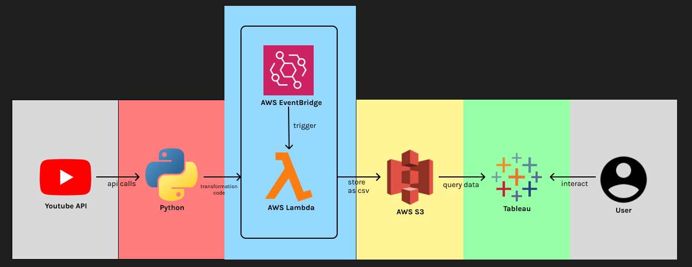
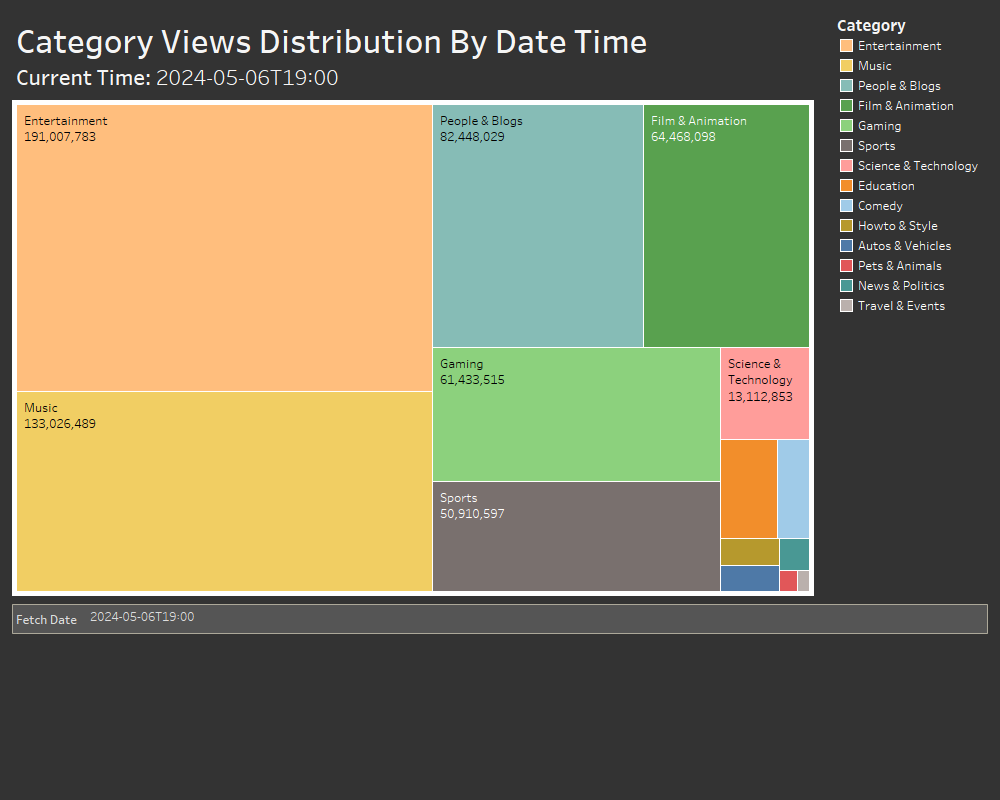

# YouTube Trending ETL Pipeline
## Overview
The YouTube Trending ETL Pipeline was created to collect data on YouTube's top 200 videos on an hourly basis. It uses Python code to perform the ETL, which is packaged into an AWS Lambda function. The function is called every hour using an AWS EventBridge scheduler. The data is stored as a .csv file and uploaded into an AWS S3 bucket. Finally, that data is queried into Tableau where the user can analyze it and create visualizations.

## Architecture

## How To Use
*I have two folders in the repository: a "Local" folder and a "AWS Lambda" folder. Download and running the files in "Local" will fetch the current trending page on YouTube and output the results as a .csv file in your local directory. The "AWS Lambda" folder contains the code needed to create the Lambda function. The .zip files are the layers which should be renamed to python.zip before creating the layer. The two layers should be attached to your Lambda function. "lambda_function.py" contains the code of the Lambda function itself.

Be sure to insert your own credentials and keys where applicable.

## Visualizations

## Closing Statements
This was a relatively small project done to explore some common data engineering technologies in a domain I was interested in (YouTube). If I were to make a change to the architecture, I would change the S3 bucket to an SQL database like PostgreSql or MySQL. This is mainly because the S3 Connector that connects the S3 bucket to Tableau still has some issues, making it more difficult to work with.
